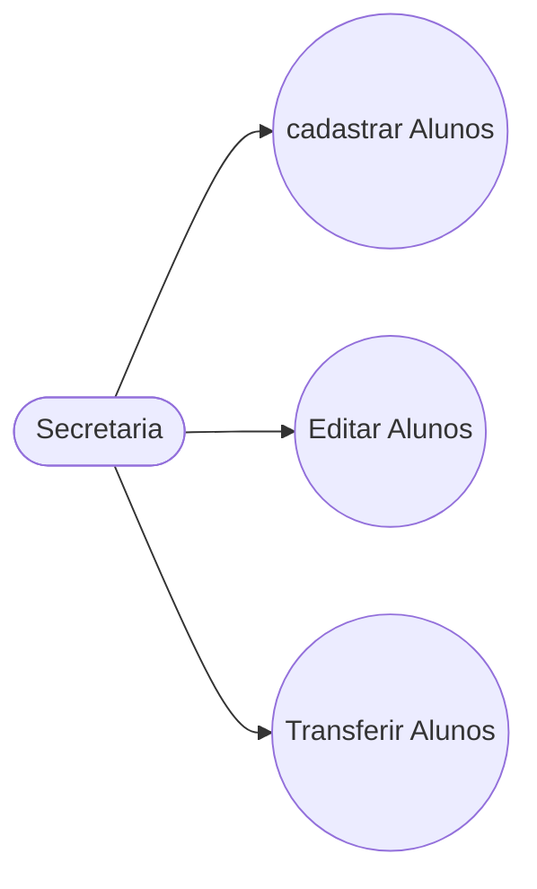
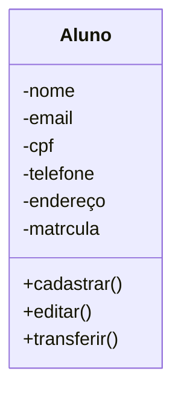

# Projeto Universidade

Modelagem em Orientação á Objetos
das Entidades Alunos, Cursos e Turma.

## Caso de Uso

## Diagrama de Classes

## Dependências
- **VSCode**: IDE(Interface de Desenvolvimento)
- **Mermaid**: LInguagem para confecção de Diagramas em documentos MD(Mark Down)
- **Material Icon Theme**: Tema para  Colorir as pasta
- **Git Lens**: Interface Grafica para o versionamento git intregado no VSCode.