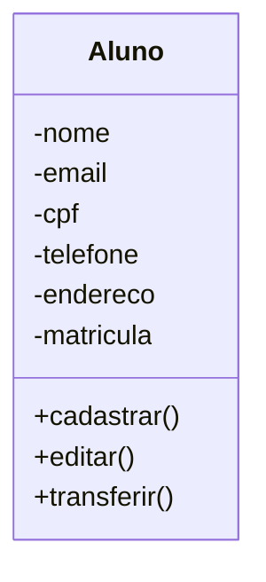

# Projeto Universidade

Modelagem em Orientação á Objetos
das Entidades Alunos, Cursos e Turma.

## Caso de Uso

## Diagrama de Classes

## Funções MySQL

- CREATE - Cria tabelas dentro da base de dados.
- INSERT - Cria registros dentro das tabelas.

- SELECT - Permite visualizar os dados dentro das tabelas. Também permite filtrar os dados que quer visualizar.

- ALTER - Altera a estrutura das tabelas, adicionando ou removendo atributos(campos).
- UPDATE - Atualiza regristros dentro da tabela.

- DROP - Exclui a tabela ou a base de dados inteira.
- DELETE - Exclui registros dentro das tabelas.

## MySQL

- Banco de Dados: Programa hospedado na máquina, com objetivo de persistir os dados fisicamente no HD.

- Base de Dados: Conjunto de tabelas.

- Tabelas: Conjunto de registros.

- Registros: Uma linha na tabela, contendo a informação dos seus atributos.

- Atributos: Uma das caracteristicas da tabela (Colunas).

# Blioteca em Python

Este é um projeto desktop, utilizando as tecnologias:

- Python
- PySide6
- PyInstaller

## Dependências

- **VSCode**: IDE(Interface de Desenvolvimento)
- **Mermaid**: LInguagem para confecção de Diagramas em documentos MD(Mark Down)
- **Material Icon Theme**: Tema para  Colorir as pasta
- **Git Lens**: Interface Grafica para o versionamento git intregado no VSCode
- **MySQL**: SGB (sistema Gerenciador de Banco de Dados). Permite conectar o usiário como servidor MySQL, possibilitando criar bases de dados , tabelas, incluir e modificar atributos r registro.

